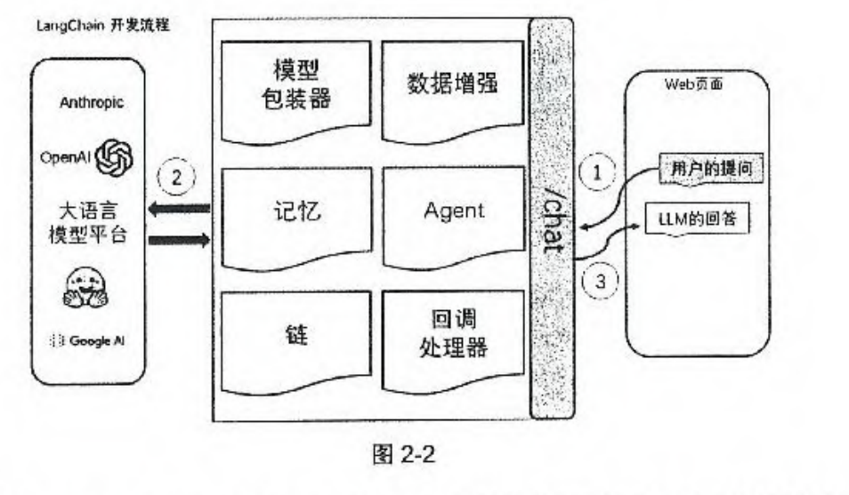

# LangChain笔记
## 1 大语言模型的基础知识
大语言模型经过长时间的单字接龙训练，就像婴儿逐渐长大一一样，对文字的理解能力也逐步提高。**当大语言模型将单字接龙游戏玩到炉火纯青、远超人类时，它自己会掌握更多的技能，比如翻译语句、回答问题、写文章，等等。**

### 提示词：驱动大语言模型运行的命令
分享一个通用提示词模板：定义角色+背景信息+任务目标+输出要求。例如
> **定义角色**：我是某公司的HR主管
> **背景信息**：现在AI发展得这么快，很多公司都面临着巨大的挑战，我们公司也一样
> **任务目标**：我要给所有同事发一封邮件，通知大家5月31日18:00来参加培训，名额仅限20人
> **输出要求**：用邮件格式输出，200字左右，段落清陈，语气要有亲和力，重点突出“名额有限”

### Token：大语言模型的基本单位
在英文中，一个Tokn可能是一个单词、一个标点符号，或者一个数字。在处理其他语言时，如中文，一个Token可能是一个单字符。在许多NLP任务中，原始文本首先被分解成Token,然后模型基于这些Token进行理解和预测。
Token也是大语言模型的商用计费单位，例如GPT-4模型每生成1000个Token需要6美分，约等于人民币0.45元，而GPT-3.5模型的使用价格只有GPT-4的1/30。

### 模型支持的上下文长度
“上下文长度”指的是模型在生成新的文本或理解输入的语句时，可以考虑的最多字数，可以理解成大语言模型的“脑容量”。例如，8K版本可以处理包含8000个Token的短篇文章，而32K版本则可以处理包含32000个Token的长篇文章。

## 大语言模型的“幻觉”
大语言模型的“幻觉”缺陷源自其本质：它是一个通过**模仿**训练数据中的模式来生成预测的模型，而不是个理解语言和知识的实体。

### 关于大语言模型的“微调”
[LoRA原文：LoRA: Low-Rank Adaptation of Large Language Models](https://arxiv.org/abs/2106.09685)

## 2 初识LangChain
LangChain是大语言模型的编程框架，它可以将大语言模型与其他工具、数据相结合，同时弥补人语言模型的短板，从而实现功能强大的应用。
### LangChain能做什么
现在，假设你要构建一个涉及语言处理的应用，比如一个智能聊天机器人，你可能会想：我难道要一步步去学习如何训练一个语言模型，如何处理各种数据，还要解决所有的兼容性问题吗？
这就是LangChain的价值所在。**LangChain是一个集成框架，它为开发者提供了一系列的T具和组件，使得与语言模型中各种数据(如SQL、PDF、CSV等)的连接、语言模型的应用和优化变得简单直接。**

> LangChain就好比一把“瑞士军刀”，你不再需要为每一个任务找一个新工具，它提供了一站式的解决方案。正如你要修理一个小小的家用电器，而你已经拥有了一个完整的工具箱。不管你遇到什么问题，打钉子、拧螺丝、剪线，工具箱里总有一个合适的工具等着你。

### 关键词：“组件”和“链"

1. 组件
组件是一个具有明确功能和用途的单元。可以看作是数据处理流水线上的各个工作站。每个组件都有其特定的职责，如处理数据的输人输出、转化数据格式。
组件包括LLM模型包装器、聊天模型包装器及与数据增强相关的一系列工具和接口。这些组件就是LangChain中的核心。
2. 链
链是将各种组件连接在一起的纽带，它能够确保组件之间的无缝集成和在程序运行环境中的高效调用。
> 举个例子，LLMChain是LangChain中最常用的链，它可以整合LLM模型包装器和记忆组件，让聊天机器人拥有“记忆”。

### 3个场景
问答系统、数据处理与管理、自动问答与客服机器人。

### 6大模块
1. 模型I/O
2. 数据增强(Data Connection)
3. 链
4. 记忆
5. Agent
6. 回调处理器(Callback)

### 开发流程
举例：设计聊天机器人的LLM应用程序

## 其他
[十几个范例带你快速上手 LangChain（包含完整代码和数据集，持续更新~）](https://github.com/luckzack/langchain-examples/tree/master)

